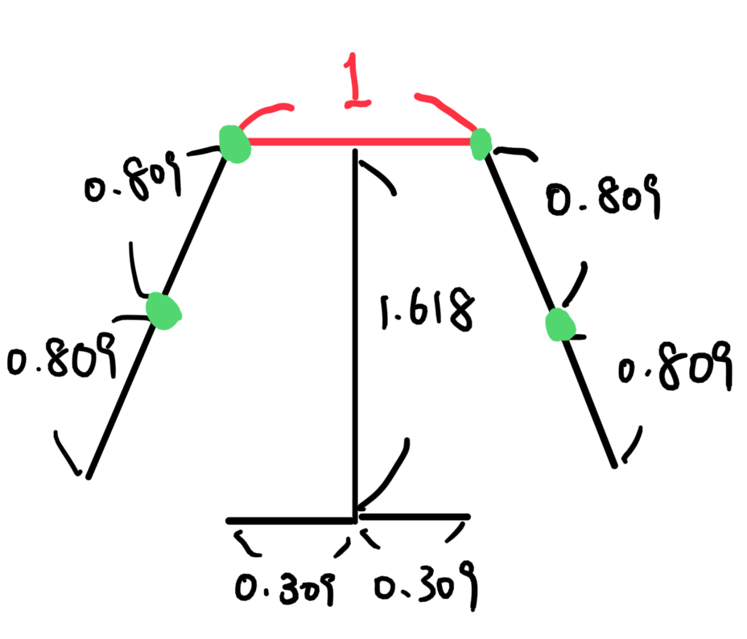
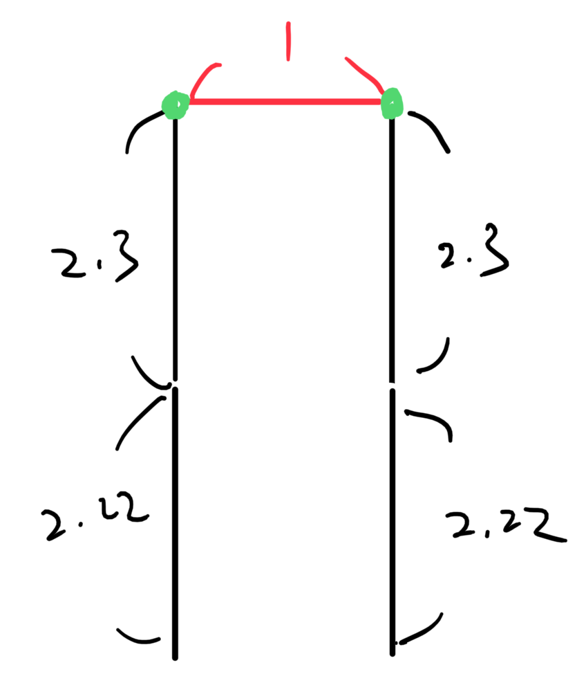
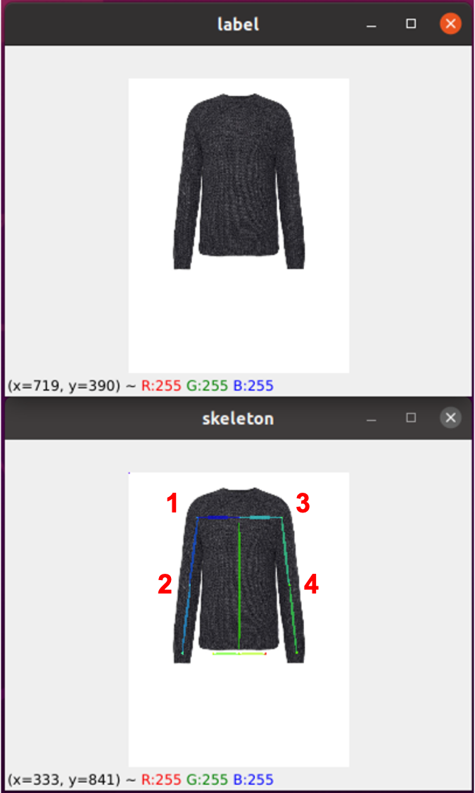

# Raw Data Preprocessing
This Respository is created to do preprocessing to raw data crawled just from the website. We first use some deep learning model to help filtering out inappropriate data. After that, we use some GUI tool to manullay filter the rest.

## Download required weight
Please run the following shell to automatically download the required weights.
```
./download_weights.sh
```
If the shell is not working, you can find the weights on the google drive: https://drive.google.com/drive/folders/1XQk30HjIkUQtKkCqELj74oqELRj4QD3f?usp=sharing

## Introduction
There are multiple preprocessing step required before we build the dataset. The exact flow is summarized as follow:
- Human Pose Generation and Filtering
- Human Parsing Generation and Filtering
- Product Mask generation
- Product Classification
- ATR Generation and Parsing Merge


## Pose Generation and Filtering
Please put model, product and human pose (generated by openpose with 25 keypoints) in folder "raw_Data". The folder name assume to be XXX_top or XXX_bottom.

The file structure is as follows:
- raw_Data
    - Example_top (brand)
        - tops (cloth category)
            - model
                - 1_model.jpg
            - product
                - 1_product.jpg
            - pose
                - 1_model_keypoints.json

**We provide some example in raw_Data folder, please follow the following commands to preprocess the data.**

We filter out those models with weird pose. To filter out them, we provide the following command:
```
python openpose_select.py --brand Example_top
```

## Parsing Generation and Filtering
To further filter out models wearing coats or jackets, which is not proper for training, we use the human parsing to filter out those models. The CIHP_PARSING folder containing the code for generating human parsing. We can move into the folder and use the following command to generate human parsing.
```
cd CIHP_PARSING
python human_parse.py --brand Example_top
cd ..
```
Also, we provide the code to filter out inapproprate data as below:
```
python parse_select.py --brand Example_top
```

## Product Mask Generation
Before align the product, we need to get the mask of product first. We can leverage the power of U2Net to segment the product. The U2Net code is in the directory "U2Net", and the usage is as follow:
```
cd U2Net
python u2net_test.py --brand Example_top
cd ..
```


## Product Classification
The information about whether a top has sleeve is helpful for product alignment. Moreover, knowing a bottom is a skirt or not, also helps for data warping. We use deep classifier to automatically predict the product type.
For tops, we use:
```
cd Sleeve_Classifier
python main.py --mode preprocess --brand Example_top
cd ..
```
For bottoms, we use:
```
cd lower_clf
python main.py --mode preprocess --brand Example_bottom
cd ..
```

## ATR Generation and Parsing Merge
To make the human parsing more robust, we also implement ATR parsing. The use is as follow: 
```
cd Self-Correction-Human-Parsing
python simple_extractor_for_preprocessing.py --dataset atr --model-restore exp-schp-201908301523-atr.pth --brand Example_top
cd ..
```
After that we use merge the two parsing with the following command:
```
python mergeLabel.py --brand Example_top
```


# Build Dataset
Finally, after all the preprocessing steps, we are going to build the training datasets. Each dataset should contains the following directories.
- Model:
    - human_model
    - human_parsing
    - human_pose
- Product:
    - product
    - product_info
    - product-mask 
    - product_parsing
    - product_pose
    - product_skeleton

## Build dataset of different resolution
To build dataset, we provide the code for aligning both models and products with different resolution. See below:
```
python build_dataset.py --brand Example_top --h 1024 --w 768
```
## Product Pose Generation
Product pose is useful for warping, we generate them with following commands.
For Tops:
```
cd Cloth2Skeleton
python main.py --mode test --config configs/config_top_v2_allData_augT.yaml --input_dir ../Training_Dataset/1024x768/Example_top/product/product --output_dir ../Training_Dataset/1024x768/Example_top/product/product_pose
cd ..
```
For Bottom:
```
cd Cloth2Skeleton
python main.py --mode test --config configs/config_bottom_v2_allData_augT.yaml --input_dir ../Training_Dataset/1024x768/Example_bottom/product/product --output_dir ../Training_Dataset/1024x768/Example_bottom/product/product_pose
cd ..
```

### Ground truth annotation
Image depicts annotation of product pose ground truth. Only green points labeled, others computed using ratios derived from dataset statistics. Clothes assumed to be aligned and in specific form.




### Labeling tool
We also provide landmarks labeling tool, please use the following command.
```
python landmarks_label_tool.py 
```
For each clothing, you should use your mouse to left-click on right shoulder, right elbow, left shoulder, left elbow in order. After clicking the 4 points, the labeled landmarks would be shown on the image, and please press any button to continue. (We assume the sleeves of clothing is straight.)



## Product Parsing (For Tops)
Product parsing can help us find out the region of interest, such as sleeve or neckline. Inference is as follow:
```
cd ClothSegmentation
python main.py --mode test --input_dir ../Training_Dataset/1024x768/Example_top/product/product/ --output_dir ../Training_Dataset/1024x768/Example_top/product/product_parsing
cd ..
```